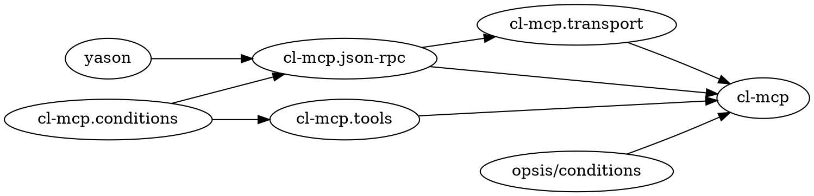

# cl-mcp — Dev Skill

## What Is cl-mcp

MCP server framework for Common Lisp. Consumers create a server, register tools, call `run-server`. Framework handles JSON-RPC 2.0 framing, stdio transport, MCP protocol dispatch, tool validation, and error recovery.

Protocol: MCP 2025-06-18. Implementation: SBCL. Build: ASDF. License: MIT.

Known consumers: `cl-mcp-server` (CL REPL tools), `chatterbox`, `ghost`.

## Quick Reference

```bash
# Load
sbcl --load cl-mcp.asd --eval "(ql:quickload :cl-mcp)"

# Test (full suite)
sbcl --load cl-mcp.asd \
     --eval "(ql:quickload :cl-mcp/tests)" \
     --eval "(asdf:test-system :cl-mcp)"
```

## Architecture

### Package Structure

| Package | File | Contents |
|---------|------|----------|
| `cl-mcp.conditions` | `src/conditions.lisp` | JSON-RPC error conditions (5 discrete codes) |
| `cl-mcp.json-rpc` | `src/json-rpc.lisp` | Message structs, parsing, encoding |
| `cl-mcp.transport` | `src/transport.lisp` | NDJSON stdio read/write |
| `cl-mcp.tools` | `src/tools.lisp` | Tool registry, validation, dispatch |
| `cl-mcp` | `src/server.lisp` | Public API: `make-server`, `register-tool`, `run-server` |

Load order enforced by ASDF `:serial t`: conditions → json-rpc → transport → tools → server.

### Key Files

```
cl-mcp.asd              System + test system definitions
src/packages.lisp       All package definitions
src/conditions.lisp     JSON-RPC 2.0 error conditions (codes: -32700, -32600, -32601, -32602, -32603)
src/json-rpc.lisp       Message structs, parse-message, encode-response
src/transport.lisp      read-message, write-message (NDJSON over stdio)
src/tools.lisp          register-tool, call-tool, normalize-tool-result
src/server.lisp         mcp-server struct, %handle-request, run-server
tests/                  FiveAM suites (6 files)
```

### Dependency Graph



## Naming Conventions

| Type | Convention | Examples |
|------|------------|---------|
| Predicates | `-p` suffix | `notification-p`, `content-block-list-p` |
| Constructors | `make-` prefix | `make-server`, `make-request` |
| Internal functions | `%` prefix | `%handle-initialize`, `%handle-request` |
| File header | `;;; ABOUTME:` comment | `;;; ABOUTME: MCP tool registry` |

## Critical Rules

### RULE-001: Request-Response Guarantee
Every valid JSON-RPC request MUST receive exactly one response.

**Applies to**: `run-server`, `%handle-request`
**Violation consequence**: MCP client hangs indefinitely.
**Agent action**: Flag. Auto-fix forbidden.

### RULE-002: Server Stability
Server MUST NOT terminate due to handler errors. All errors MUST be caught and returned as JSON-RPC error responses.

**Applies to**: `run-server` (outer loop), `%handle-request` (inner dispatch)
**Violation consequence**: Server process dies on first tool error.
**Agent action**: Flag. Auto-fix forbidden.

### NOTE: Two-Level register-tool Design

`cl-mcp.tools:register-tool` (internal): takes five positional args — `(registry name description input-schema handler)`.
`cl-mcp:register-tool` (public API wrapper in `server.lisp`): takes keyword args — `(server name &key description schema handler)`.

These are different functions. The public wrapper calls the internal one. When adding registry functions in `cl-mcp.tools`, use positional args; the public keyword interface lives only in `server.lisp`.

### RULE-003: Per-Server Registry
Each `mcp-server` has its own tool registry (hash-table). No global `*tools*` or similar variable is permitted.

**Applies to**: All registry functions in `cl-mcp.tools`
**Violation consequence**: Cross-instance tool contamination.
**Agent action**: Flag. Auto-fix forbidden.

### RULE-004: Handler Contract
Handlers MUST accept exactly one argument (`arguments` alist) and MUST return a string or a list of MCP content blocks. Consumer state MUST live in closures, not in the handler signature.

**Applies to**: All `handler` arguments passed to `register-tool`
**Violation consequence**: `normalize-tool-result` may misclassify output; content blocks malformed.
**Agent action**: Flag. Suggest wrapping non-conforming handlers in a closure.

## Invariants

| ID | Invariant |
|----|-----------|
| INV-001 | Every valid JSON-RPC request receives exactly one response |
| INV-002 | Server never terminates due to handler errors |
| INV-003 | Tool registries are per-server (no global state) |
| INV-004 | Handler results are always normalized to MCP content format before sending |
| INV-005 | All messages conform to JSON-RPC 2.0 (`"jsonrpc": "2.0"` field present) |

## Testing Strategy

Framework: FiveAM. Test suite symbol: `cl-mcp-tests` in package `cl-mcp-tests`.

| Suite file | Covers |
|------------|--------|
| `conditions-tests.lisp` | Error codes, messages, condition hierarchy |
| `json-rpc-tests.lisp` | Request/response creation, JSON parsing |
| `encoding-tests.lisp` | Response encoding, null ID, error encoding |
| `transport-tests.lisp` | NDJSON read/write, EOF handling |
| `tools-tests.lisp` | Registration, listing, validation, dispatch, normalization |
| `server-tests.lisp` | Full MCP session flows, error recovery |

Add new tests in the same file as the code under test. `server-tests.lisp` uses string streams to simulate stdio.

## Observability (opsis)

Server emits events via `opsis/c:emit` at:
- `:server-started` — on `run-server` entry
- `:server-stopped` — on EOF
- `:request-received` — each incoming request (data: `:method`)
- `:request-failed` — unhandled errors (level: `:error`); data shape varies by site:
  - In `%handle-request` catch-all: `(list :method method :condition-type (type-of c))`
  - In `run-server` catch-all: `(list :condition-type (type-of c))`
  - In `run-server` `json-rpc-error` handler: no `:data` argument

Dependency: `opsis/conditions` (from `../opsis/`).

## References

- [Integration Skill](../integration/SKILL.md) — for consumers using cl-mcp
- [AGENT.md](../../../AGENT.md) — contributing guidelines (legacy, absorbed here)
- [README.md](../../../README.md) — project navigation
