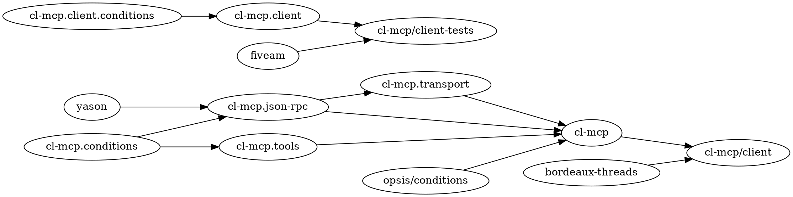

# cl-mcp — Dev Skill

## What Is cl-mcp

MCP **server and client** framework for Common Lisp.

- **Server** (`cl-mcp`): Expose CL functions as MCP tools. Three calls: `make-server` → `register-tool` → `run-server`.
- **Client** (`cl-mcp/client`): Connect to MCP server subprocesses, list tools, call tools. Threaded reader loop with promise-based request/response correlation.

Protocol: MCP 2025-06-18 (server) / 2025-11-25 (client). Implementation: SBCL. Build: ASDF. License: MIT.

Known consumers: `cl-mcp-server` (CL REPL tools), `chatterbox`, `ghost`.

## Quick Reference

```bash
# Load server
sbcl --load cl-mcp.asd --eval "(ql:quickload :cl-mcp)"

# Load client
sbcl --load cl-mcp.asd --eval "(ql:quickload :cl-mcp/client)"

# Test server (full suite)
sbcl --load cl-mcp.asd \
     --eval "(ql:quickload :cl-mcp/tests)" \
     --eval "(asdf:test-system :cl-mcp)"

# Test client (full suite)
sbcl --load cl-mcp.asd \
     --eval "(ql:quickload :cl-mcp/client-tests)" \
     --eval "(asdf:test-system :cl-mcp/client)"
```

## Architecture

### Server Package Structure

| Package | File | Contents |
|---------|------|----------|
| `cl-mcp.conditions` | `src/conditions.lisp` | JSON-RPC error conditions (5 discrete codes) |
| `cl-mcp.json-rpc` | `src/json-rpc.lisp` | Message structs, parsing, encoding |
| `cl-mcp.transport` | `src/transport.lisp` | NDJSON stdio read/write |
| `cl-mcp.tools` | `src/tools.lisp` | Tool registry, validation, dispatch |
| `cl-mcp` | `src/server.lisp` | Public API: `make-server`, `register-tool`, `run-server` |

Load order enforced by ASDF `:serial t`: conditions → json-rpc → transport → tools → server.

### Client Package Structure

| Package | File | Contents |
|---------|------|----------|
| `cl-mcp.client.conditions` + `cl-mcp.client` | `src/client/packages.lisp` | Both package definitions + all exports |
| `cl-mcp.client.conditions` | `src/client/conditions.lisp` | `in-package` + condition `define-condition` forms only |
| `cl-mcp.client` | `src/client/protocol.lisp` | encode-request, parse-client-message, pending-request promise machinery |
| `cl-mcp.client` | `src/client/client.lisp` | mcp-client struct, connect/disconnect, list-tools, call-tool, with-mcp-client |

Client depends on `cl-mcp` (shared json-rpc structs) and `bordeaux-threads`.

### Key Files

```
cl-mcp.asd                    System definitions: cl-mcp, cl-mcp/client, cl-mcp/tests, cl-mcp/client-tests
src/packages.lisp             Server package definitions
src/conditions.lisp           JSON-RPC 2.0 error conditions (-32700, -32600, -32601, -32602, -32603)
src/json-rpc.lisp             Message structs (json-rpc-request, json-rpc-response), parse-message, encode-response
src/transport.lisp            read-message, write-message (NDJSON over stdio)
src/tools.lisp                register-tool, call-tool, normalize-tool-result
src/server.lisp               mcp-server struct, %handle-request, run-server
src/client/packages.lisp      Client package definitions
src/client/conditions.lisp    Client conditions (mcp-connect-error, mcp-session-closed, mcp-protocol-error, mcp-tool-error)
src/client/protocol.lisp      encode-request, parse-client-message, pending-request promise
src/client/client.lisp        mcp-client struct, connect, disconnect, list-tools, call-tool, with-mcp-client
tests/                        FiveAM suites (server, 6 files)
tests/client/                 FiveAM suites (client, 4 ASDF-loaded files: packages, conditions-tests, protocol-tests, client-tests)
tests/client/test-server.lisp Standalone subprocess fixture (loaded via sbcl --load by client-tests, NOT an ASDF component)
```

### Dependency Graph



### Client Threading Model

```
Caller thread: connect → list-tools → call-tool → disconnect
Reader thread: %reader-loop → parse-client-message → %dispatch-response → fulfill-promise
```

Synchronization:
- `client-pending-lock` — protects `pending` hash-table and `next-id` counter
- Each `pending-request` has its own lock+condvar for caller/reader rendezvous
- Promises registered BEFORE sending to avoid response-before-register race
- `%abort-all-pending`: fulfills all pending with error on EOF; collects under lock, fulfills outside to avoid lock-order inversion

## Naming Conventions

| Type | Convention | Examples |
|------|------------|---------|
| Predicates | `-p` suffix | `notification-p`, `content-block-list-p` |
| Constructors | `make-` prefix | `make-server`, `make-client`, `make-request` |
| Internal functions | `%` prefix | `%handle-initialize`, `%send-request`, `%reader-loop` |
| File header | `;;; ABOUTME:` comment | `;;; ABOUTME: MCP client` |

## Critical Rules — Server

### RULE-001: Request-Response Guarantee
Every valid JSON-RPC request MUST receive exactly one response.

**Applies to**: `run-server`, `%handle-request`
**Violation consequence**: MCP client hangs indefinitely.
**Agent action**: Flag. Auto-fix forbidden.

### RULE-002: Server Stability
Server MUST NOT terminate due to handler errors. All errors MUST be caught and returned as JSON-RPC error responses.

**Applies to**: `run-server` (outer loop), `%handle-request` (inner dispatch)
**Violation consequence**: Server process dies on first tool error.
**Agent action**: Flag. Auto-fix forbidden.

### NOTE: Two-Level register-tool Design
`cl-mcp.tools:register-tool` (internal): five positional args — `(registry name description input-schema handler)`.
`cl-mcp:register-tool` (public): keyword args — `(server name &key description schema handler)`.
These are different functions. The public wrapper calls the internal one.

### RULE-003: Per-Server Registry
Each `mcp-server` has its own tool registry (hash-table). No global `*tools*` or similar variable is permitted.

### RULE-004: Handler Contract
Handlers MUST accept exactly one argument (`arguments` alist) and MUST return a string or a list of MCP content blocks.

## Critical Rules — Client

### RULE-005: Promise Registration Before Send
`pending-request` MUST be registered in the pending table BEFORE the request is written to server stdin.

**Applies to**: `%send-request`
**Violation consequence**: Race condition — response arrives before promise exists, dropped silently.
**Agent action**: Flag. Auto-fix forbidden.

### RULE-006: Lock Order
`client-pending-lock` → `pending-request` lock. Never acquire in reverse order.

**Applies to**: `%dispatch-response`, `%abort-all-pending`
**Violation consequence**: Deadlock.
**Agent action**: Flag. Auto-fix forbidden.

### RULE-007: Abort All On EOF
On EOF or reader thread error, ALL pending requests MUST be fulfilled with an error response.

**Applies to**: `%reader-loop`, `%abort-all-pending`
**Violation consequence**: Calling threads block forever.
**Agent action**: Flag. Auto-fix forbidden.

## Invariants

| ID | Invariant |
|----|-----------|
| INV-001 | Every valid JSON-RPC request receives exactly one response |
| INV-002 | Server never terminates due to handler errors |
| INV-003 | Tool registries are per-server (no global state) |
| INV-004 | Handler results are always normalized to MCP content format before sending |
| INV-005 | All messages conform to JSON-RPC 2.0 (`"jsonrpc": "2.0"` field present) |
| INV-006 | Client: pending promise registered before request written to stdin |
| INV-007 | Client: all pending requests aborted on EOF or reader thread failure |

## Testing Strategy

Framework: FiveAM.

### Server Tests

Suite symbol: `cl-mcp-tests` in `cl-mcp-tests`.

| Suite file | Covers |
|------------|--------|
| `conditions-tests.lisp` | Error codes, messages, condition hierarchy |
| `json-rpc-tests.lisp` | Request/response creation, JSON parsing |
| `encoding-tests.lisp` | Response encoding, null ID, error encoding |
| `transport-tests.lisp` | NDJSON read/write, EOF handling |
| `tools-tests.lisp` | Registration, listing, validation, dispatch, normalization |
| `server-tests.lisp` | Full MCP session flows, error recovery (string streams simulate stdio) |

### Client Tests

Suite symbol: `cl-mcp-client-tests` in `cl-mcp-client-tests`.

| Suite file | Covers |
|------------|--------|
| `conditions-tests.lisp` | Client condition types, messages, accessors |
| `protocol-tests.lisp` | encode-request, parse-client-message, pending-request promise |
| `client-tests.lisp` | connect/disconnect, list-tools, call-tool, with-mcp-client |
| `test-server.lisp` | In-process test server fixture for client integration tests |

## Observability (opsis)

Server emits events via `opsis/c:emit` at:
- `:server-started` — on `run-server` entry
- `:server-stopped` — on EOF
- `:request-received` — each incoming request (data: `:method`)
- `:request-failed` — unhandled errors (level: `:error`)

Dependency: `opsis/conditions` (source: https://github.com/quasi/opsis).

## References

- [Integration Skill](../integration/SKILL.md) — for consumers using cl-mcp
- [README.md](../../../README.md) — project navigation
